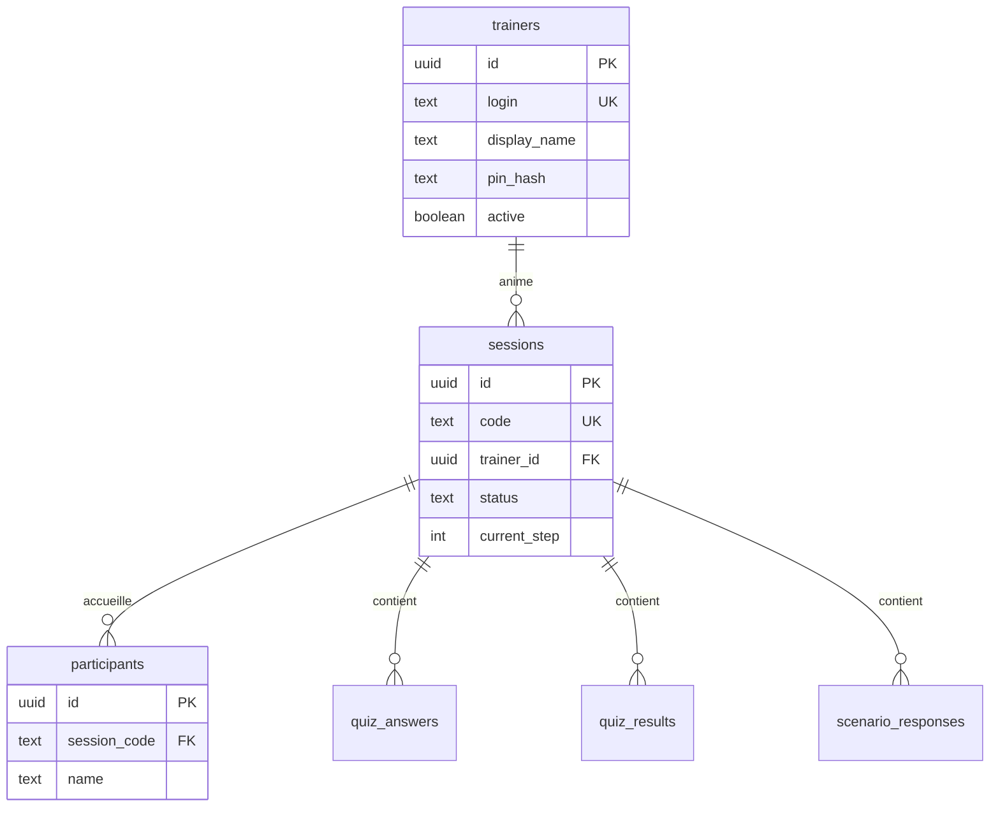

# Plan BDD → Vercel → Rework app

## Clarification

| Nom | C’est quoi ? |
|-----|----------------|
| **TrainerView** | Composant React (`src/components/TrainerView.js`) — écran formateur pendant la session |
| **trainers** | Table Supabase à créer — comptes formateurs |
| **sessions** | Table Supabase — une ligne par session avec **code généré** |

---

## Ordre recommandé (ton idée est la bonne)

```
Phase A — BDD Supabase (schéma propre)
    ↓
Phase B — Vercel (2 variables + redeploy)
    ↓
Phase C — Rework code (login formateur, code session dynamique, écran d’attente)
```

Ne pas reworker l’app avant que le schéma + Vercel soient stables.

---

## Phase A — Reprendre la BDD Supabase

### A1. Environnement

- Créer une **branche Supabase** (preview) ou utiliser un **projet dev** dédié.
- Ne pas casser la prod tout de suite.

### A2. Exécuter le schéma

**BDD déjà en prod** (comme sur ton screenshot) :

Fichier : **`supabase/migration-from-current.sql`** ← celui-ci

**Projet vide** :

Fichier : `supabase/schema.sql`

1. Supabase Dashboard → **SQL Editor**
2. Coller **tout** le fichier (pas d’exemple avec `...`)
3. **Run**
4. Vérifier **Table Editor** : table `trainers` + colonnes `status`, `trainer_id` sur `sessions`

### A3. Tables cibles

| Table | Rôle |
|-------|------|
| `trainers` | Login + PIN hashé (remplace `.env` formateurs) |
| `sessions` | Code session dynamique + état (step, module…) |
| `participants` | Personnes qui rejoignent une session |
| `quiz_answers`, `quiz_results`, `scenario_responses` | Données formation |
| `module_results`, `session_history` | Stats / archive |
| `trainer_notes`, `trainer_weather`, `trainer_state` | Dashboard formateur |
| `onboarding_sessions` | Entrées / onboarding |

### A4. Migration depuis l’existant

Si des tables existent déjà sans FK :

1. Exporter les données (CSV ou SQL)
2. Ajouter les colonnes / FK progressivement
3. Ou repartir sur branche vide + réimporter

**Transition** : le script insère une session `LPT2026` pour que l’app actuelle continue de marcher.

### A5. RLS (sécurité — à faire avant prod)

Minimum à prévoir (Phase A ou début C) :

- `trainers` : **aucune lecture** côté anon (PIN hash invisible)
- `sessions` : lecture si `status = waiting|active` ; écriture limitée
- `participants` : insert si session ouverte ; select par `session_code`

Vérification login formateur : **Edge Function** `verify-trainer` (recommandé) — pas de SELECT sur `pin_hash` depuis le front.

---

## Phase B — Connecter Vercel

### Variables à garder (seulement 2)

```env
NEXT_PUBLIC_SUPABASE_URL=https://xxx.supabase.co
NEXT_PUBLIC_SUPABASE_ANON_KEY=eyJ...
```

### À retirer après Phase C

- `NEXT_PUBLIC_SESSION_CODE`
- `NEXT_PUBLIC_TRAINER_CODE_*`
- `NEXT_PUBLIC_TRAINER_AUTH_JSON`

### Checklist Vercel

- [ ] Variables sur Production + Preview
- [ ] Redeploy
- [ ] Test URL prod : page d’accueil charge sans erreur config

---

## Phase C — Rework app (après A + B)

### C1. Login formateur

- Appel Edge Function `verify-trainer(login, pin)` → retourne `trainer_id` + token session locale
- Supprimer `getTrainerCredentials()` / variables env formateurs

### C2. Code session dynamique

- Bouton « Lancer la session » → `INSERT sessions` avec code aléatoire (4–6 car.)
- Stocker `activeSessionCode` en state + localStorage formateur
- Remplacer `SESSION_CODE` global partout par ce code

### C3. Écran d’attente (TrainerView)

- Gros affichage du **code**
- Liste participants (déjà là)
- Option QR : `?join=1&code=XXXX`

### C4. Login participant

- Champ **code session** (obligatoire)
- Prénom/nom + code → `participants`

### C5. Nettoyage

- Retirer `LPT2026` hardcodé
- Doc équipe : plus de codes dans Vercel

---

## Schéma relationnel (cible)



---

## État actuel de l’app (référence)

Tables **déjà utilisées** dans le code :

`sessions`, `participants`, `quiz_answers`, `quiz_results`, `scenario_responses`, `module_results`, `session_history`, `trainer_notes`, `trainer_weather`, `trainer_state`, `onboarding_sessions`

Table **à ajouter** : `trainers`

Composant **écran formateur** : `TrainerView.js` (pas une table)

---

## Prochaine action concrète

1. Exécuter `supabase/schema.sql` sur une branche / projet de test
2. Vérifier les tables dans le dashboard
3. Mettre à jour Vercel (2 variables)
4. Valider que l’app actuelle tourne encore (session `LPT2026`)
5. Démarrer Phase C (Edge Function + code dynamique)
