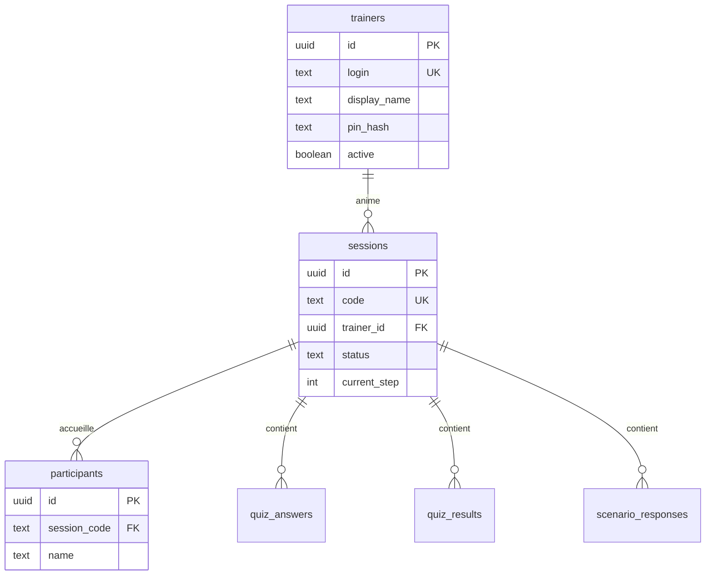

# Plan BDD → Vercel → Rework app

## Clarification

| Nom | C’est quoi ? |
|-----|----------------|
| **TrainerView** | Composant React (`src/components/TrainerView.js`) — écran formateur pendant la session |
| **trainers** | Table Supabase à créer — comptes formateurs |
| **sessions** | Table Supabase — une ligne par session avec **code généré** |

---

## Ordre recommandé (ton idée est la bonne)

```
Phase A — BDD Supabase (schéma propre)
    ↓
Phase B — Vercel (2 variables + redeploy)
    ↓
Phase C — Rework code (login formateur, code session dynamique, écran d’attente)
```

Ne pas reworker l’app avant que le schéma + Vercel soient stables.

---

## Phase A — Reprendre la BDD Supabase

### A1. Environnement

- Créer une **branche Supabase** (preview) ou utiliser un **projet dev** dédié.
- Ne pas casser la prod tout de suite.

### A2. Exécuter le schéma

**BDD déjà en prod** (comme sur ton screenshot) :

Fichier : **`supabase/migration-from-current.sql`** ← celui-ci

**Projet vide** :

Fichier : `supabase/schema.sql`

1. Supabase Dashboard → **SQL Editor**
2. Coller **tout** le fichier (pas d’exemple avec `...`)
3. **Run**
4. Vérifier **Table Editor** : table `trainers` + colonnes `status`, `trainer_id` sur `sessions`

### A3. Tables cibles

| Table | Rôle |
|-------|------|
| `trainers` | Login + PIN hashé (remplace `.env` formateurs) |
| `sessions` | Code session dynamique + état (step, module…) |
| `participants` | Personnes qui rejoignent une session |
| `quiz_answers`, `quiz_results`, `scenario_responses` | Données formation |
| `module_results`, `session_history` | Stats / archive |
| `trainer_notes`, `trainer_weather`, `trainer_state` | Dashboard formateur |
| `onboarding_sessions` | Entrées / onboarding |

### A4. Migration depuis l’existant

Si des tables existent déjà sans FK :

1. Exporter les données (CSV ou SQL)
2. Ajouter les colonnes / FK progressivement
3. Ou repartir sur branche vide + réimporter

**Transition** : le script insère une session `LPT2026` pour que l’app actuelle continue de marcher.

### A5. RLS (sécurité — à faire avant prod)

Minimum à prévoir (Phase A ou début C) :

- `trainers` : **aucune lecture** côté anon (PIN hash invisible)
- `sessions` : lecture si `status = waiting|active` ; écriture limitée
- `participants` : insert si session ouverte ; select par `session_code`

Vérification login formateur : **Edge Function** `verify-trainer` (recommandé) — pas de SELECT sur `pin_hash` depuis le front.

---

## Phase B — Connecter Vercel

### Variables à garder (seulement 2)

```env
NEXT_PUBLIC_SUPABASE_URL=https://xxx.supabase.co
NEXT_PUBLIC_SUPABASE_ANON_KEY=eyJ...
```

### À retirer après Phase C

- `NEXT_PUBLIC_SESSION_CODE`
- `NEXT_PUBLIC_TRAINER_CODE_*`
- `NEXT_PUBLIC_TRAINER_AUTH_JSON`

### Checklist Vercel

- [ ] Variables sur Production + Preview
- [ ] Redeploy
- [ ] Test URL prod : page d’accueil charge sans erreur config

---

## Phase C — Rework app (après A + B)

### C1. Login formateur

- Appel Edge Function `verify-trainer(login, pin)` → retourne `trainer_id` + token session locale
- Supprimer `getTrainerCredentials()` / variables env formateurs

### C2. Code session dynamique

- Bouton « Lancer la session » → `INSERT sessions` avec code aléatoire (4–6 car.)
- Stocker `activeSessionCode` en state + localStorage formateur
- Remplacer `SESSION_CODE` global partout par ce code

### C3. Écran d’attente (TrainerView)

- Gros affichage du **code**
- Liste participants (déjà là)
- Option QR : `?join=1&code=XXXX`

### C4. Login participant

- Champ **code session** (obligatoire)
- Prénom/nom + code → `participants`

### C5. Nettoyage

- Retirer `LPT2026` hardcodé
- Doc équipe : plus de codes dans Vercel

---

## Schéma relationnel (cible)



---

## État actuel de l’app (référence)

Tables **déjà utilisées** dans le code :

`sessions`, `participants`, `quiz_answers`, `quiz_results`, `scenario_responses`, `module_results`, `session_history`, `trainer_notes`, `trainer_weather`, `trainer_state`, `onboarding_sessions`

Table **à ajouter** : `trainers`

Composant **écran formateur** : `TrainerView.js` (pas une table)

---

## Prochaine action concrète

1. Exécuter **`supabase/migration-rooms-final.sql`** sur prod ou branche test
2. Vérifier les tables dans le dashboard (`export-schema.sql`)
3. Mettre à jour Vercel (2 variables)
4. Valider que l’app actuelle tourne encore (session `LPT2026`)
5. Démarrer Phase C (voir plan multi-salles ci-dessous)

---

## Plan multi-salles (validé — spec produit)

### Modèle

- **1 salle = 1 ligne `sessions`** ; `sessions.code` = identifiant unique (dans l’URL du QR aussi).
- Données formation (`participants`, `quiz_*`, etc.) isolées par `session_code`.
- **`trainer_state`** :
  - clé **`__weekly__`** → liste RH (`entrees_data`), partagée entre formateurs ;
  - clé **`session_code`** → TV, QR, module en cours **par salle**.

### Création de salle

Au clic **« Ouvrir ma salle »** (juste avant l’affichage TV / QR), pas au login formateur :

1. Si le formateur a déjà une salle `active` → retour direct (**tuile « Ma salle »**).
2. Sinon → choix **catégorie** + label optionnel → `INSERT sessions` (code auto, `status = active`).
3. Affichage QR : `?join=1&code=XXXX`.
4. **« Réafficher le QR »** après pause : même salle, pas de nouvelle ligne.

**Règle** : **1 formateur = 1 salle active max** (Kevin + Nadège en parallèle = OK ; Kevin × 2 salles simultanées = non).

### Fin de salle

- Bouton formateur **« Terminer la salle »** → `status = ended`, `ended_at` renseigné.
- Plus de nouvelles entrées (liste ni QR).
- Participants déjà connectés : message « Session terminée ».
- Reconnexion après `ended` : bloquée.

### Participant — deux chemins

| Chemin | Étapes |
|--------|--------|
| **Sans QR** | Nom → résolution RH → **catégorie** du collab → liste des salles `waiting\|active` compatibles → choix → join |
| **Avec QR** | `?join=1&code=XXXX` → nom seulement → join (salle déjà choisie) |

### Filtre par catégorie — extensible

**Principe** : une **catégorie** est un **slug** partagé entre la fiche RH du collaborateur et la salle (`sessions.room_type`). Aujourd’hui : `presentiel`, `visio`. Demain : `hybride`, `belgique_presentiel`, etc. **sans changer le modèle BDD**.

#### Registre central (app)

Fichier prévu : `src/lib/formationCategories.js`

```js
// Exemple — source de vérité des catégories connues
export const FORMATION_CATEGORIES = {
  presentiel: { label: 'Présentiel · Paris', order: 1 },
  visio:      { label: 'Visio · Province & Belgique', order: 2 },
  // hybride: { label: 'Hybride', order: 3 },  // futur
}
```

Ajouter une catégorie = **1 entrée dans ce registre** + formulaire création de salle + (optionnel) règle d’import RH.

#### Fiche RH (`entrees_data` dans `__weekly__`)

Chaque collaborateur aura un champ optionnel **`formation_category`** (slug).

| Priorité | Source de la catégorie |
|----------|------------------------|
| 1 | `entree.formation_category` si renseigné (explicite, import RH ou édition manuelle) |
| 2 | **Règle de repli** : magasin → catégorie (comportement actuel onboarding) |

Repli v1 (inchangé fonctionnellement) :

| Magasin (`classifyMagasin`) | Catégorie par défaut |
|----------------------------|----------------------|
| `paris` | `presentiel` |
| `province`, `belgique` | `visio` |

#### Salle (`sessions.room_type`)

Même slug que `formation_category`. Le formateur choisit la catégorie à la création.

#### Matching liste salles

```
salles_visibles = sessions WHERE status IN ('waiting','active')
                  AND room_type = resolveCategory(entree)
```

Si aucune salle : message adapté (« Aucune salle {label} ouverte »).

**Évolution sans migration** : nouvelle catégorie → nouveau slug dans le registre ; pas de `ALTER TABLE` si le slug respecte `[a-z][a-z0-9_]*` (contrainte SQL déjà prévue).

#### QR

Le QR **ne filtre pas** : il fixe la salle. La catégorie sert uniquement au parcours **sans QR**.

### Deux QR (coexistence)

| Contexte | URL | Rôle |
|----------|-----|------|
| Onboarding (tuiles Journée) | `?join=1` | Entrée semaine — flux onboarding existant |
| Formation / modules | `?join=1&code=XXXX` | Rejoindre une salle précise |

### Présence & reconnexion

- `participants.left_at` + `last_seen_at` (heartbeat ~45–60 s).
- Reconnexion même nom + même salle + pas `ended` → reprise module en cours.

### Login formateur v1

- PIN restent en **`.env`** pour la Phase C multi-salles.
- Table `trainers` + Edge Function `verify-trainer` = phase ultérieure.

### Phase C — ordre de dev suggéré

1. Création / reprise salle formateur + `activeSessionCode`
2. QR dynamique par `session_code`
3. Login participant (nom → catégorie → liste salles)
4. Présence (`left_at` / heartbeat)
5. Fin de salle (`ended`)
6. Basculer lecture RH vers `__weekly__` + `formation_category` sur import

### Scripts BDD

| Fichier | Usage |
|---------|--------|
| **`migration-rooms-final.sql`** | Prod incrémentale (colonnes multi-salles + `__weekly__`) |
| `schema.sql` | Référence greenfield |
| `fix-formation-tables-prod.sql` | Colonnes quiz (séparé) |

